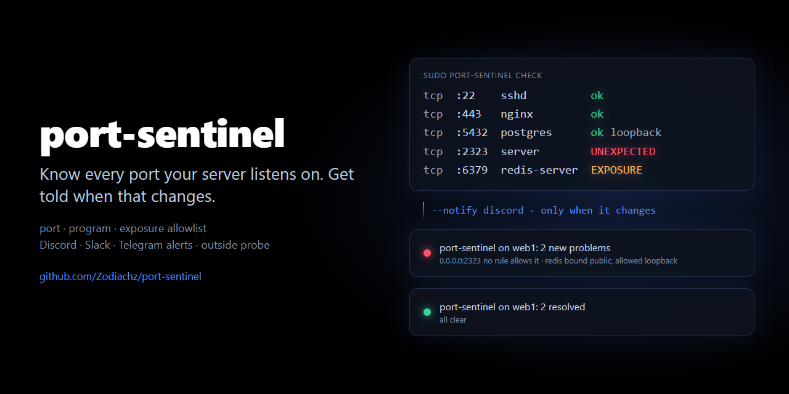

# port-sentinel



**Know every port your server listens on. Get told when that changes.**

`port-sentinel` checks every listening socket on a Linux server against a short allowlist you keep next to it: which ports, which program, how far the bind address reaches. Anything else is a problem, and it can alert Discord, Slack, Telegram, ntfy or any webhook the moment it appears, and again when it is gone.

```console
$ sudo port-sentinel scan
PROTO  ADDRESS    PORT  EXPOSURE  PID      PROGRAM                        STATUS
tcp    0.0.0.0    22    public    812      sshd                           ok
tcp    0.0.0.0    443   public    1204+4   nginx                          ok
tcp    127.0.0.1  3000  loopback  2210     node /srv/api/server.js        ok
tcp    0.0.0.0    2323  public    9417     server                         UNEXPECTED: no rule allows tcp/2323
tcp    127.0.0.1  5432  loopback  988      postgres                       ok
tcp    0.0.0.0    6379  public    1011     redis-server                   EXPOSURE: bound to 0.0.0.0 (public), allowed: loopback
udp    127.0.0.1  323   loopback  640      chronyd                        ok
```


## Why

You close a port. Weeks later it is open again: a service restarted with its default config, someone ran `ufw allow` to test something, a new container published a port, a database was moved to `0.0.0.0` "for a minute". Nothing breaks, so nobody notices. Firewall rules tell you what is *allowed*; they do not tell you what is *listening*, or when that changed.

`port-sentinel` watches the other side: the sockets themselves. It answers three questions, continuously:

1. **Is anything listening that should not be?** A new port, or a known port held by a different program.
2. **Is anything bound wider than it should be?** Redis on `0.0.0.0` instead of `127.0.0.1` is the same port and a very different risk.
3. **Is everything that should be listening, listening?** Mark `sshd` or your database as `required`.

And `probe` checks the same allowlist **from the outside**, to see what the internet can really reach through your firewall.

## Install

One file, Python 3.8+ standard library only.

```bash
sudo curl -fsSL https://raw.githubusercontent.com/Zodiachz/port-sentinel/main/port-sentinel -o /usr/local/bin/port-sentinel
sudo chmod +x /usr/local/bin/port-sentinel
```

Run it as root: that is what lets it see which program owns each socket. Without root it still works, but sockets of other users show their program as `?`.

## Quick start

```bash
sudo port-sentinel scan          # what listens right now
sudo port-sentinel init          # write /etc/port-sentinel/allow.conf from it
sudo nano /etc/port-sentinel/allow.conf   # review: delete what should not be there, tighten scopes
sudo port-sentinel check         # exit 0 when everything is allowed, 1 when not
```

`init` writes one line per program and scope, with the ports merged (`80,443`, `19132-19135`). For interpreters (node, python, php, ruby…) it also pins the script with `cmd=`, so two Node apps are two rules and a third one is caught:

```
tcp    22,33      sshd
tcp    80,443     nginx
tcp    8084       node cmd=*/opt/game/src/servers/tcp.js*
tcp    8790       node cmd=*/opt/panel/src/server.js*          loopback
tcp    5432       postgres                                     loopback
udp    10101      match-server
```

## The allowlist

One rule per line: `PROTO PORTS [PROGRAM] [OPTIONS]`. `#` starts a comment.

| Field | Values |
|---|---|
| `PROTO` | `tcp`, `udp` or `any` |
| `PORTS` | `22`, `80,443`, `8000-8099`, or `*` for any port |
| `PROGRAM` | glob on the program name: `sshd`, `redis*`, `python3`. Nothing or `*` = any program |
| scope | `public` (default): any bind address, `0.0.0.0` too · `private`: loopback or a private/LAN address · `loopback`: `127.0.0.1` / `::1` only |
| `required` | alert when nothing matching this rule is listening |
| `cmd=GLOB` | glob on the full command line. No spaces in a token: use `?` for a space |

```bash
# the front door
tcp  22       sshd          required
tcp  80,443   nginx         required
# app servers stay behind nginx
tcp  3000     node          loopback  cmd=*/srv/api/server.js*
# databases never leave the machine
tcp  5432     postgres      loopback  required
tcp  6379     redis-server  loopback
# reachable from the private network only
tcp  9100     node_exporter private
```

A socket is fine when **one** rule covers its protocol and port, fits **every** program holding it, and allows its exposure. Otherwise you get one of:

| Problem | Meaning |
|---|---|
| `UNEXPECTED` | no rule covers this protocol and port |
| `PROCESS` | the port is allowed, but for another program (or the owner is unknown and the rule names one) |
| `EXPOSURE` | right port, right program, bound wider than allowed (`0.0.0.0` where `loopback` was expected) |
| `MISSING` | a `required` rule has nothing listening |

The file is looked up in `--allow FILE`, then `$PORT_SENTINEL_ALLOW`, then `/etc/port-sentinel/allow.conf`, then `./port-sentinel.conf`. A full example is in [examples/port-sentinel.conf](examples/port-sentinel.conf).

## Alerts

`--notify TARGET` (repeatable), or targets separated by spaces in `$PORT_SENTINEL_NOTIFY` so the URLs stay out of your unit files and `ps`:

| Target | Sent as |
|---|---|
| `https://discord.com/api/webhooks/…` | a Discord message (mentions disabled) |
| `https://hooks.slack.com/services/…` | a Slack message |
| `https://api.telegram.org/bot<TOKEN>/sendMessage?chat_id=<ID>` | a Telegram message |
| `https://ntfy.sh/<topic>` | an ntfy push notification |
| any other `http(s)://` URL | the full event as JSON |
| `exec:COMMAND` | the full event as JSON on the command's stdin |

```
🚨 port-sentinel on web1: 1 new problem
+ UNEXPECTED  tcp 0.0.0.0:2323         server          no rule allows tcp/2323
1 problem open
```

With `--state FILE`, a run alerts only on **changes**: a new problem once, and a "resolved" message when it goes away. Without it, every run that finds a problem alerts. If a target fails, the state is not saved, so the alert is retried on the next run. Webhook tokens never appear in logs.

## Run it

**Every 5 minutes with systemd** (recommended). The units in [contrib/](contrib/) run a sandboxed `check --state` and keep only the capabilities needed to read the socket tables:

```bash
sudo curl -fsSL -o /etc/systemd/system/port-sentinel.service https://raw.githubusercontent.com/Zodiachz/port-sentinel/main/contrib/port-sentinel.service
sudo curl -fsSL -o /etc/systemd/system/port-sentinel.timer https://raw.githubusercontent.com/Zodiachz/port-sentinel/main/contrib/port-sentinel.timer
echo 'PORT_SENTINEL_NOTIFY=https://discord.com/api/webhooks/…' | sudo tee /etc/port-sentinel/env
sudo chmod 600 /etc/port-sentinel/env
sudo systemctl daemon-reload && sudo systemctl enable --now port-sentinel.timer
```

**Or with cron:**

```cron
*/5 * * * * root /usr/local/bin/port-sentinel check -q --state /var/lib/port-sentinel/state.json --notify https://ntfy.sh/my-topic
```

**Or as a long-running process:** `port-sentinel watch --interval 30 --state …` checks in a loop, logs every change with a timestamp, and reloads the allowlist when you edit it.

## Probe from the outside

A socket bound to `0.0.0.0` might still be blocked by your firewall, and a port can be reachable through a forwarding rule without anything on the host listening where you expect. `probe` does a plain TCP connect scan of a host **you own** and applies the same allowlist:

```console
$ port-sentinel probe web1.example.com --allow web1.conf
open: 22, 80, 443
ok: 3 open ports, all allowed
```

- An open port is fine when a `tcp`/`any` rule with scope `public` covers it (`--lan` when you probe from the same network: `private` rules count too).
- A `required` public rule whose ports are all closed is reported as `UNREACHABLE`: your site is down, or the firewall eats it.
- It runs anywhere Python does, including Windows and macOS.

> **Probe from a server or CI, not from home.** A scan of thousands of ports through a consumer router can trip its flood protection and cut your own connection to that host for a few minutes. The default is 64 parallel connections; lower it with `--workers` if needed.

### As a GitHub Action

Scan your server from the internet every hour, from a private repository that holds the allowlist:

```yaml
on:
  schedule: [{ cron: "17 * * * *" }]
jobs:
  probe:
    runs-on: ubuntu-latest
    steps:
      - uses: actions/checkout@v4
      - uses: Zodiachz/port-sentinel@v1
        with:
          host: ${{ secrets.SERVER_HOST }}
          allowlist: servers/web1.conf
          notify: ${{ secrets.DISCORD_WEBHOOK }}
```

Inputs: `host`, `allowlist`, `ports` (default all), `timeout`, `workers`, `notify`. The job fails when a problem is open. See [examples/external-probe.yml](examples/external-probe.yml).

## How it works

- **Sockets** come from `/proc/net/tcp`, `tcp6`, `udp` and `udp6`: TCP sockets in `LISTEN`, and UDP sockets that are bound with no peer, i.e. anything that accepts a datagram from anyone. IPv4-mapped IPv6 addresses are shown as IPv4.
- **Owners** come from `/proc/<pid>/fd/*` → `socket:[inode]`. The program name is `comm`, or the executable name when `comm` was cut at 15 characters or rewritten by the process (pm2 does that). Rules match either, and `cmd=` matches `/proc/<pid>/cmdline`.
- **Exposure**: `0.0.0.0` and `::` are `public`; `127.0.0.0/8` and `::1` are `loopback`; any other non-global address (RFC 1918, CGNAT, link-local, ULA) is `private`.
- No shelling out to `ss`, `netstat` or `lsof`: a scan of a busy server takes about 50 ms.

## Limits

- `scan`, `init`, `check` and `watch` read Linux `/proc`. They see the host's network namespace only: a container with its own network is invisible, but the ports it publishes are not (`docker-proxy` listens on the host, or the port shows up in `probe` when Docker uses iptables alone).
- UDP clients that use `sendto()` without `connect()` look like listeners on a random high port. `init` writes those as the ephemeral port range for that program.
- `probe` is TCP only: an unanswered UDP datagram does not tell "closed" from "filtered".

## Exit codes

`0` everything allowed · `1` at least one problem · `2` usage or configuration error.

## Development

```bash
python -m unittest discover -s tests -v
```

The tests run on Linux, macOS and Windows with fake `/proc` tables; on Linux they also check real sockets owned by the test process.

## License

MIT
